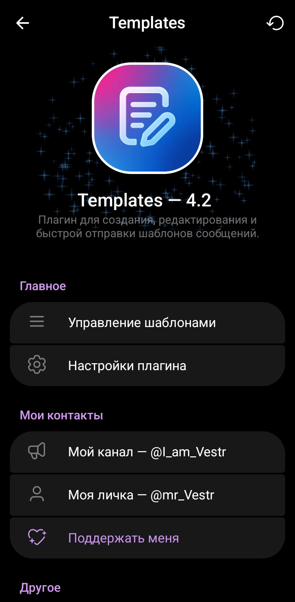
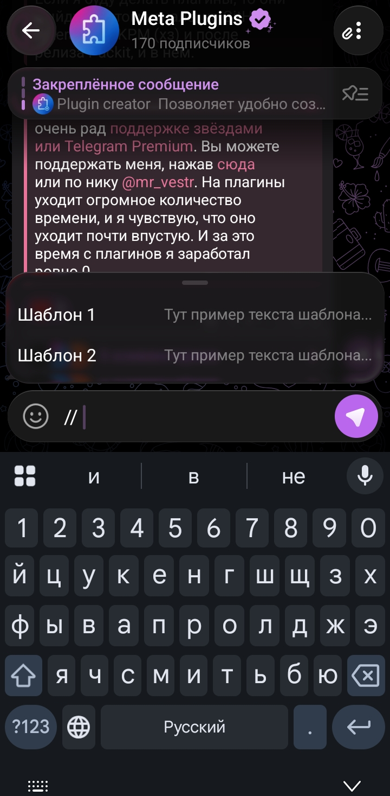
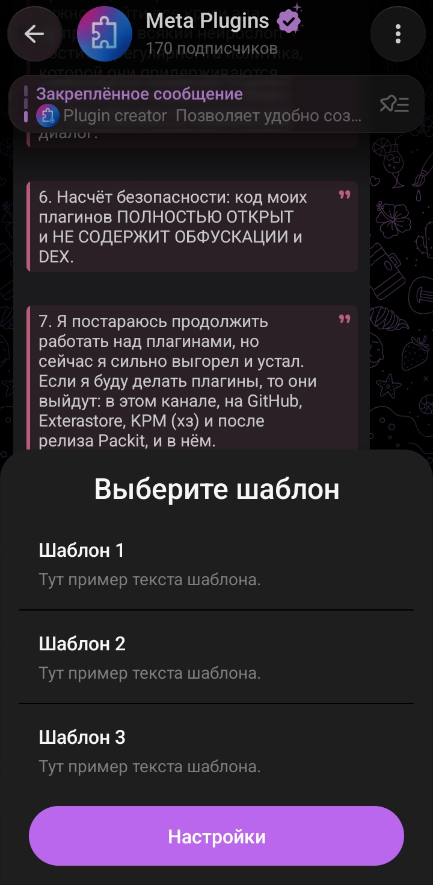

# Плагины для exteraGram / AyuGram
### • Русский | [English](https://github.com/mr-Vestr/plugins/blob/main/README_EN.md)

---

 

## Templates | Шаблоны

**Возможности:**
- Быстро легко и удобно создавайте, редактируйте, удаляйте и отправляйте шаблоны сообщений;
- Есть поддержка форматирования;
- Есть экспорт / импорт шаблонов;
- Имеются гибкие настройки, поддержка двух языков и тд.

### **Подробнее про [Templates](https://github.com/mr-Vestr/plugins/blob/main/Templates/TEMPLATES.md).**

 

---

 

## Plugin creator

**Возможности:**
- Быстро из текста создать файл плагина;
- У плагина есть гибкие настройки;
- Имеется поддержка двух языков и тд.

### **Подробнее про [Plugin creator](https://github.com/mr-Vestr/plugins/blob/main/Plugin%20creator/PLUGIN_CREATOR_RU.md).**

 

---

## Как использовать:
- Требуется последняя версия [exteraGram](https://t.me/exteraGram) или [Ayugram](https://t.me/AyuGramReleases) с поддержкой плагинов;
- Просто отправьте файл плагина в любой чат и нажмите кнопку «Установить».

---

## **Подписывайтесь на мой [Telegram-канал](https://t.me/I_am_Vestr) :)**
